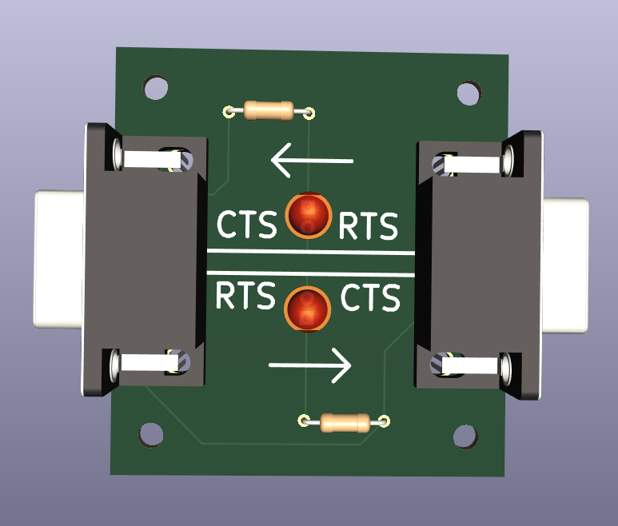

# Nullmodem-Adapter

Dieses Repository beinhaltet Baupläne für einen Nullmodem-Adapter, der im Kapitel Kommunikation in Rechnernetzen [Kommunikation in Rechnernetzen - Bitübertragung und Sicherung](inf-schule.de/@/page/HNnpDFMzrLsl27Bz) auf [inf-schule.de](inf-schule.de) verwendet werden kann.

